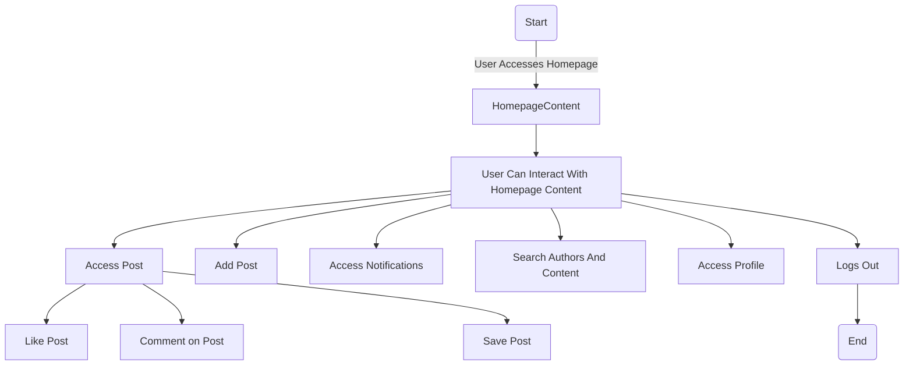

# Homepage Design: Enhancing User Interaction
## Overview
A user logs into their account, the page is directed to the homepage. This homepage displays posts from the user's favorite authors, as well as popular posts. Additionally, users have the capability to interact with these posts by liking, commenting, saving, or reporting them.
## Design Features:
Homepage – Seamless Integration of Elements: Logo, Navigation, Headline, CTA, Photos, Text Content, and Footer.

Logo – The forum's identity is represented by the logo.

Navigation – The navigation bar hosts multiple buttons, each directing users to specific functionalities within the forum.

Headline – Displaying the forum name and providing a search bar for easy content discovery.

CTA – Empowering users to engage by enabling them to comment on posts.

Photos – Posts incorporate images to enhance visual appeal and content richness.

Text Content – Posts contain textual information, fostering communication and information sharing.

Footer – The footer section includes various interactive buttons and links.

These features are designed to offer a flexible and user-friendly experience, ensuring effective use of the forum. The homepage serves as a gateway to showcase these features.

## HomePage Design
.png)

##  Implementation Strategy:

Our implementation plan comprises the following crucial steps:

-   Integration Support: We are implementing interfaces to seamlessly integrate with buttons, facilitating navigation to specific functionalities. These functionalities are being developed by other teams, ensuring smooth collaboration.
    
-   Webpage Design: We are meticulously crafting the webpage to effectively display all the available features within the forum. This design aims to provide users with an intuitive and engaging interface for an enhanced forum experience.

## Flow Chart:

## Team

-   Saisri Gajula    
-   Revathi Ankem
